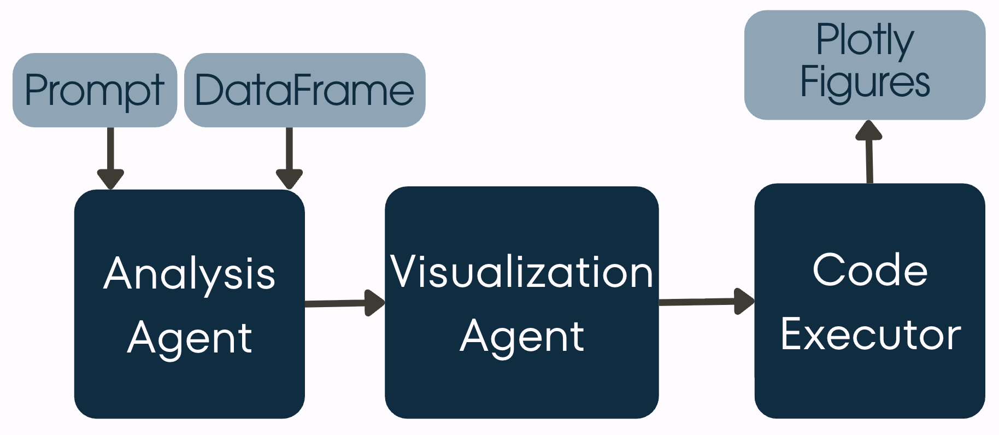
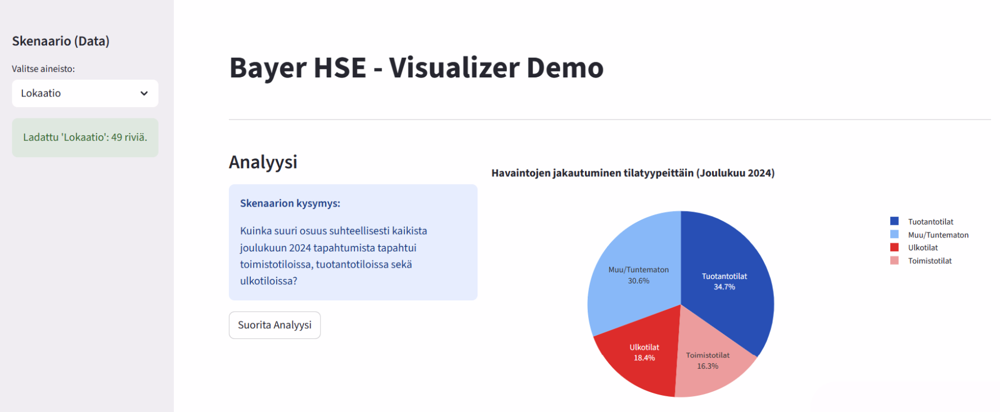

# Bayer HSE - Visualizer Demo

A two-stage LLM-powered analytics tool for generating visualizations from data. This application uses AI to automatically categorize observations and generate intelligent visualizations based on natural language queries.


## Features

- **Simple API**: Single method `visualize(prompt, dataframe)` returns a Plotly figure
- **LLM-Driven**: Automatically analyzes and categorizes data using AI
- **Interactive Charts**: Generates Plotly visualizations ready for Streamlit
- **Configurable**: Adjust LLM behavior through `config.py`

## Architecture
```
Prompt + DataFrame → Analysis Agent → Visualization Agent → Code Executor → Plotly Figures
```


The system follows a three-phase pipeline:
1. **Phase 1: Analysis Agent**: Analyzes data and creates relevant categories
2. **Phase 2: Visualization Agent**: Generates Python/Plotly code for visualization
3. **Phase 3: Code Executor**: Executes code and returns an interactive Plotly figure

## Chart Generation + Verification

The system follows a three-phase pipeline to ensure accurate and interactive visualizations:

1.  **Phase 1: Analysis Agent**: The LLM analyzes the raw Finnish safety observations and the user's query. It generates transformation logic (categories, keyword mappings, derived fields) to structure the data for analysis.
2.  **Phase 2: Visualization Agent**: Based on the transformed data structure, the LLM generates Python code using `plotly.express`. It handles date parsing, numeric conversions, and aggregations. All titles and labels are generated in Finnish.
3.  **Phase 3: Code Executor**: The generated code is executed in a controlled environment. The system verifies the output by extracting the resulting Plotly figure (`fig`), chart type, and the aggregated `plot_data`. If execution fails, it provides detailed error feedback.

## Data Source / How to Reproduce

-   **Data Source**: The demo application uses data from [data/bayer_data.xlsx](data/bayer_data.xlsx) located in the `data/` directory.
-   **Scenarios**: The pre-configured questions for each data sheet are defined in [data/prompts.json](data/prompts.json).
-   **Reproduction**: 
    1.  Ensure you have followed the [Installation](#installation) and [Configuration](#configuration) steps.
    2.  Run the demo app: `uv run streamlit run app.py`.
    3.  Select any sheet (e.g., "Rappuset") from the sidebar.
    4.  Click "Suorita Analyysi" to generate the visualization based on the data and scenario-specific prompt.

## Requirements
- **uv**
- **Python 3.13** (uv will automatically install this version if you don't have it installed)
- **OpenRouter API key** (for LLM access)

## Installation

1. **Install uv** - [Installation guide](https://github.com/astral-sh/uv#installation)

```bash
# macOS/Linux
curl -LsSf https://astral.sh/uv/install.sh | sh

# Windows
powershell -ExecutionPolicy ByPass -c "irm https://astral.sh/uv/install.ps1 | iex"
```

2. **Clone and go to project directory**

```bash
git clone https://github.com/vinaysanga/bayer-visualiser.git
cd bayer-visualiser
```

3. **Setup dependencies**

```bash
uv sync
```

## Configuration

1. **Rename `.env.example` to `.env`** in the project root, and fill in your OpenRouter API key:

```bash
OPENROUTER_API_KEY=your_api_key_here
MODEL_NAME=google/gemini-3-pro-preview
```

2. **Adjust LLM behavior** (optional) in `config.py`:

```python
LLM_TEMPERATURE_CATEGORIZATION = 0.3  # Lower = more consistent categories
LLM_TEMPERATURE_VISUALIZATION = 0.0   # 0 = deterministic code generation
```

## Usage

There are two ways to use this library/application:

### 1. Integration with Existing Applications (as asked in the challenge)

The `visualize()` method provides a simple wrapper for integrating LLM-powered visualizations into your existing application:

```python
from semantic_visualizer import SemanticVisualizer
import os

# Initialize once (e.g., at app startup)
viz = SemanticVisualizer(
    openrouter_api_key=os.getenv("OPENROUTER_API_KEY"),
    llm_model=os.getenv("MODEL_NAME")
)

# Use anywhere in your application
def create_chart(user_prompt, dataframe):
    """Generate a chart from user's natural language query"""
    try:
        fig = viz.visualize(user_prompt, dataframe)
        return fig
    except Exception as e:
        print(f"Visualization error: {e}")
        return None

# Example: In your Streamlit/Flask/FastAPI app
fig = create_chart("Show monthly trends", my_df)
if fig:
    st.plotly_chart(fig)  # Streamlit
    # or fig.show()       # Standalone
    # or fig.to_html()    # Web apps
```

### 2. Running the Demo Application

```bash
uv run streamlit run app.py
```

The app will open in your browser at `http://localhost:8501`

### Demo Workflow

1. **Select Scenario**: Choose a sheet from the sidebar
2. **Review Question**: See the pre-configured analysis question
3. **Run Analysis**: Click "Suorita Analyysi"
4. **View Results**: Explore the generated visualization




## Project Structure

```
bayer-visualiser/
├── app.py                      # Main Streamlit application
├── semantic_visualizer.py      # Core LLM logic
├── config.py                   # Configuration settings
├── pyproject.toml              # Project metadata and dependencies
├── .python-version             # Python version (3.13)
├── .env                        # Environment variables (create this)
├── .venv/                      # Virtual environment (created by uv)
├── data/
│   ├── bayer_data.xlsx        # Your Excel data
│   └── prompts.json           # Scenario questions
└── README.md                  # This file
```

## Customization

### Change LLM Model

Edit `.env`:
```bash
MODEL_NAME=anthropic/claude-3.5-sonnet
# or
MODEL_NAME=google/gemini-2.5-pro
# or any other model from OpenRouter
```

### Adjust Temperature

Edit `config.py`:
```python
LLM_TEMPERATURE_CATEGORIZATION = 0.5  # More creative categories
LLM_TEMPERATURE_VISUALIZATION = 0.1   # Slightly varied visualizations
```

## Troubleshooting

### "Module not found" errors
```bash
# Reinstall dependencies
uv sync
```

### "API key not found"
- Ensure `.env` file exists in project root
- Check that `OPENROUTER_API_KEY` is set correctly

### Slow performance
- Consider using a faster model from OpenRouter

### Python version issues
```bash
# uv automatically uses the version from .python-version
# If needed, you can install a specific version:
uv python install 3.13
```

## Notes

- The app sends observation data to OpenRouter's LLM API
- First run may be slower as it loads the streamlit app
- Generated visualizations are deterministic (temperature=0.0)
- All data processing happens locally except LLM API calls